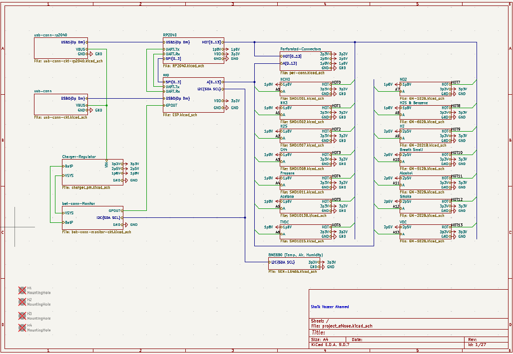
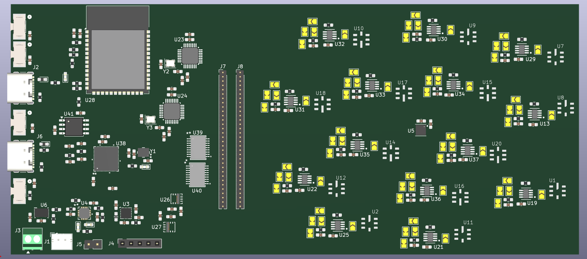

# Electronic Nose System

A compact 14-channel MEMS-based Electronic Nose (E-Nose) platform designed for multi-gas sensing applications. The system integrates analog signal acquisition, dual-microcontroller processing, heater control, and battery-powered operation on a custom-designed PCB developed using KiCad.

---

## Overview

The Electronic Nose System is a modular hardware platform designed to interface with fourteen MEMS gas sensors for detecting a wide range of volatile organic compounds (VOCs) and hazardous gases. The design combines dedicated analog front-end circuits, a dual-microcontroller architecture, and an efficient power management subsystem into a compact printed circuit board.

The project focuses on hardware architecture, PCB implementation, and modular subsystem design to support future gas classification and pattern recognition algorithms.

---

## Key Features

- 14-channel MEMS gas sensor array
- ESP32-S3 main controller
- RP2040 dedicated PWM co-processor
- Configurable analog front-end
- Battery-powered operation
- Dual heater voltage rails (1.8 V and 2.5 V)
- BME680 environmental sensing
- KiCad 9.0.7 PCB design
- Modular hardware architecture

---

## System Architecture

```text
                    +----------------------+
                    |   MEMS Gas Sensors   |
                    +----------+-----------+
                               |
                               v
                    +----------------------+
                    |  Analog Front End    |
                    +----------+-----------+
                               ^
                               |
                              SPI
                               |
                               v
                    +----------------------+
                    |   ESP32-S3 (Master)  |
                    +----+--+---------+----+
                         |  ^         |
                         |  |         |
                      UART SPI       I²C/ADC
                         |  |         |
                         v  v         v
                  +--------------+  BME680
                  |    RP2040    |
                  +------+-------+
                         |
                         v
                +------------------+
                |  Heater Driver   |
                +--------+---------+
                         |
                         v
                +------------------+
                |  MEMS Heaters    |
                +------------------+

          Power Management supplies all modules
```

<p align="center">
  
</p>
---
---

## PCB Layout

### Top View

<p align="center">
  
</p>

### 3D View

<p align="center">
  
</p>

<p align="center">
  
</p>

---

## Hardware Specifications

| Component | Description |
|-----------|-------------|
| Gas Sensors | 14 MEMS Gas Sensors |
| Main Controller | ESP32-S3 |
| PWM Controller | RP2040 |
| Heater Driver | TBD62083AFNG |
| Environmental Sensor | BME680 |
| Analog Front End | TLV9152 |
| PCB Software | KiCad 9.0.7 |
| Power Source | Rechargeable Li-ion Battery |

---

## Repository Structure

```text
Electronic-Nose-PCB
│
├── Hardware
│   ├── Sensors
│   ├── Analog_Front_End
│   ├── ESP32-S3
│   ├── RP2040
│   ├── Power_Management
│   ├── PCB
│   └── KiCad_Project
│
├── Documentation
├── Datasheets
└── README.md
```
---

## Hardware

The hardware design is divided into modular subsystems:

- MEMS Gas Sensor Array
- Analog Front-End
- ESP32-S3 Processing Unit
- RP2040 PWM Controller
- Heater Driver
- Battery Management
- PCB Layout

---

## Software

| Tool | Purpose |
|------|---------|
| KiCad 9.0.7 | PCB Design |
| GitHub | Version Control |

---

## Project Status

🚧 Under Development

Current progress:

- ✅ System Architecture
- ✅ Schematic Design
- ✅ PCB Layout
- ⏳ PCB Fabrication
- ⏳ Hardware Testing
- ⏳ Firmware Development

---

## License

This project is intended for academic and research purposes.

---

## Acknowledgment

This work was carried out at the International Institute of Information Technology Bangalore (IIIT Bangalore) under the guidance of Prof. Kurian Polachan. Technical guidance and discussions from Prof. David Aleklett Kadish and David Cuartielles (Malmö University and Arduino Co-founder) are gratefully acknowledged.
